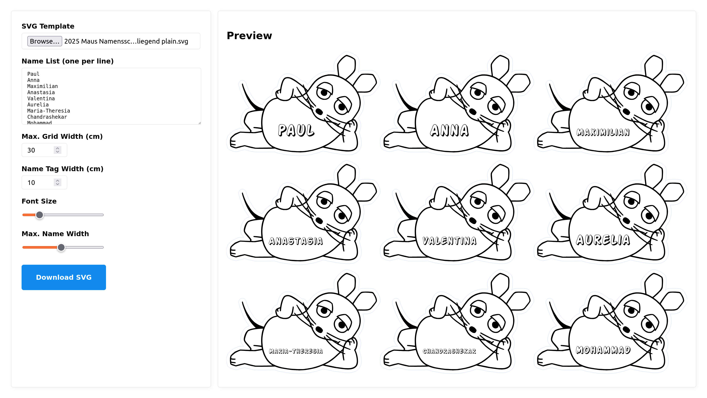

# SVG Grid Name Tool

This web tool allows you to generate a grid of name tags from an SVG template.
We use this for creating name tags for laser cutting for events like the _["Türen auf mit der Maus" @ FabLab Karlsruhe](https://fablab-karlsruhe.de/2025/08/22/tueren-auf-mit-der-maus-am-3-oktober-im-fablab-karlsruhe/)_.

## Usage
1. Open [orzechow.github.io/svg-name-tags](https://orzechow.github.io/svg-name-tags/)
2. Upload an SVG template (must contain one text field for the name)
3. Enter a list of names (one per line)
4. Set maximum page width and width per name tag
5. Tune font size and name width to fit short and long names
6. Generates a single SVG with all names arranged in a grid
7. Download the generated SVG
8. For laser cutting etc., use Inkscape or a similar tool to convert text to paths

## Limitations
- Only works with SVG templates that have a single text element for the name.
- Text-to-path conversion is not supported in-browser.

---

MIT License
